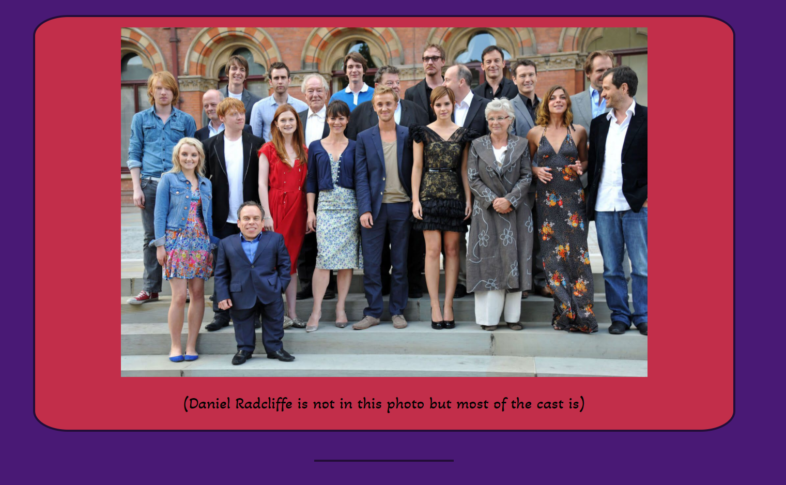
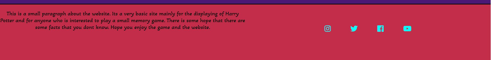

<h2><strong>Overall Site:</strong></h2>
This site is named "Harry Potter Memory Game" as it has been designed around the Harry Potter series, books and films together. I have decided to make this for the second project Milestone because they are some of my favourite books and films and I thought I would share some fun facts and some interesting information. 

To start, I will describe the process of deciding to put this site together and how I designed it all to work together. 

<h3><strong>Why this design?</strong></h3>

I mainly decided to base the whole layout and design value on the "Night Bus" as that is one of my favourite scenes within the films. I cannot say that I used wireframes to put together a mock version of the site and this is because I thought it would be better to put it together from scratch. However, I did draw up a physical sketch on paper as a rough guide as to what to aim for. Of course, to make things a more detailed I could put some together for next time as it will allow the vision to be there to be shared for others. 

<h3><strong>INDEX Page </strong></h3>

So, working from the first page of course I started from the top. Which begins with the title of the page along with navigation. Implementing the functionality was quite simple, making each one a link to the next page as well as then making the logo. 

From making the title and the navigation it was making the main content for the index.html page and deciding how much I wanted to put in. The main focus for the site, I wanted to be the memory game as that is what this milestone project is about. 

</img>

<h4><strong>Memory Game:</strong></h4>

</img>

Now this is the memory game when a user first loads the website. Very Harry Potter themed. The images the user first gets to see is the Harry Potter Hogwarts logo and this was found on the internet and I saved it and copied it into my images folder <a href="https://wallpapercave.com/harry-potter-logo-wallpapers" target="_blank">Source</a>. This was just by a simple Google search. I chose this image as the backs of my cards as I liked the design and thought it looked like it would work well with the overall aesthetic. 

When it comes to the cards being flipped over I decided to go for photos of the actors when they were younger from the first few films which is shown in the image below. This was chosen as these show the actors in their earlier school attire in comparision to the latest photos I could find.

</img>

When it came to implementing the code to work the actual game side of things I had to use another site for guidance which I shall link <a href="https://medium.com/free-code-camp/vanilla-javascript-tutorial-build-a-memory-game-in-30-minutes-e542c4447eae" target="_blank">here</a>. I used this code to get my game working which was extremely useful and here is a copy of it below:

</img>

When a user clicks on one of the images they select the card and when clicked on a second then the cards will attempt to match, if they do then success and they stay that way, if they don't then the flip back again. It's a very simple memory game but it works and it works as it should. 

The container below this is the container for the Author and mind behind the Harry Potter series, this had to be added in as she deserves the recognition for the work she has done. The container itself was easy enough to put together and get into place and from there it was just a matter of putting in the content. Of course I copied the information from the linked site and this being her actual about page. Give their site a look, its very nice. An image is below as to how it looks:

</img>

From here it is the film facts and book facts, which is given away by what they are called, are facts about the books and the films. These may be facts the user already knows but I have also linked both of these to the source sites, both working and enabling the user to do some true research. Picking these facts was easy enough, I picked the first ones that I didn't know but there is definitly room to add more to the lists. 

</img>

Next on the INDEX page is the YouTube Video of the trailers for all the films. I believed this was a good idea to have added to help draw more users in to start their interest in the franchise/ series. The video has been tested to make sure it works and that the user can watch the content that is intended to be shown. With this it was just a matter of sizing it correctly and making sure that it fit correctly within the container, which works well in my eyes and fits the websites' layout. 

What follows this video is an image of the cast all together, however there may be one or two members missing from the photo, which I explained below the photo so that whoever sees the site will understand. Similar to the YouTube video this was a matter of making sure the image fit within the container which has been labelled what it is within the CSS file. I chose the photo because I thought it looked nice and managed to capture a good portion of the cast together. Below is an image as to how it looks when the site is loaded;

</img>

Finally, for the INDEX page there is the footer, which contains a small paragraph explaining the site and next to that is working links/ icons which take the user to the corresponding social media site. Each one has been linked up and tested to make sure they work as well as a small size change when they are hovered over. Below is an image of it loaded. 

</img>